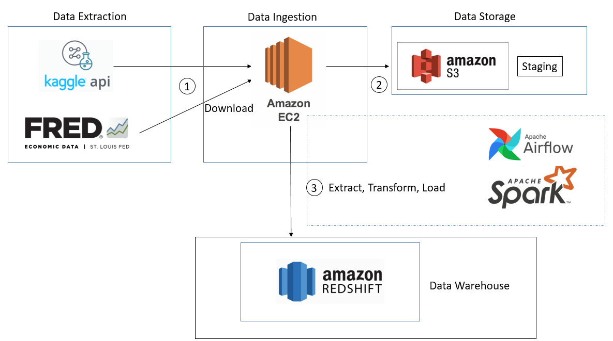
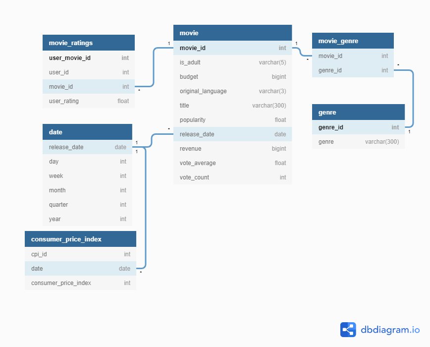
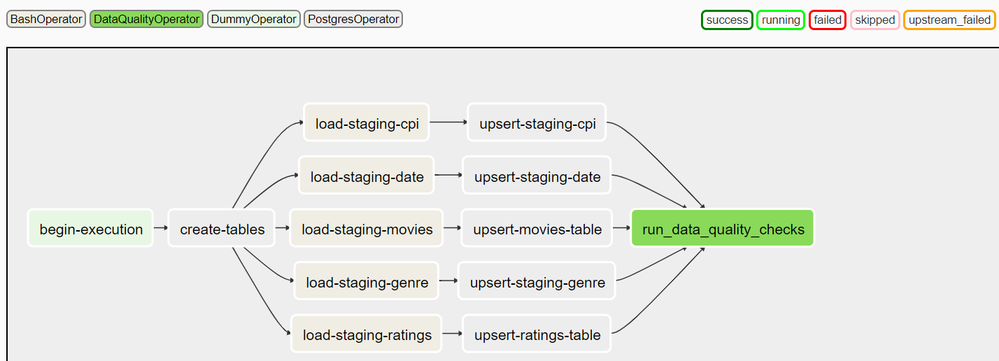

## MovieHut
---
  

## Project Description
---
* This project is a case study for a start-up, involved with recommending movies to users as a service, as well as investigating certain factors contributing to the success of movies.
* The aim of this project, is to perform Extract, Transform, Load, on movies data, to answer questions the business may have about its users, such as:
    * What is the highest rated movie of all time?
    * Which genre of movies are the most popular with users?
    * Trends in box office earnings - Does releasing a movie at a certain quarter/month of a year, lead to higher box office earnings?
    * Which genres are the highest earning of all-time, normalized against a consumer price index?

* The movies data and metadata comes from Movielens, extracted from a Kaggle dataset: https://www.kaggle.com/rounakbanik/the-movies-dataset. The data contains 26 million user ratings of over 270,000 users on a collection of over 45,000 movies.
* In addition, Consumer Price Index of Admission to Movies, Theaters, and Concerts in U.S. City Average is extracted from: https://fred.stlouisfed.org/series/CUSR0000SS62031. This will help us normalize box office earnings against inflation over the years.

## Architecture
---
The technical architecture for this project is as show below:  
  


1. Data Extraction is done using Kaggle API and using GET request to St Louis Fred's CPI dataset.  
Set up an EC2 instance with python and pip installed. Then, run `pip install kaggle`. To download the movielens dataset, run 
```bash
kaggle datasets download -d "rounakbanik/the-movies-dataset"
```  
For St Louis Fred's Consumer Price Index dataset, run 
```bash
wget https://fred.stlouisfed.org/graph/fredgraph.csv?bgcolor=%23e1e9f0&chart_type=line&drp=0&fo=open%20sans&graph_bgcolor=%23ffffff&height=450&mode=fred&recession_bars=on&txtcolor=%23444444&ts=12&tts=12&width=1168&nt=0&thu=0&trc=0&show_legend=yes&show_axis_titles=yes&show_tooltip=yes&id=CUSR0000SS62031&scale=left&cosd=1999-01-01&coed=2020-04-01&line_color=%234572a7&link_values=false&line_style=solid&mark_type=none&mw=3&lw=2&ost=-99999&oet=99999&mma=0&fml=a&fq=Monthly&fam=avg&fgst=lin&fgsnd=2009-06-01&line_index=1&transformation=lin&vintage_date=2020-05-31&revision_date=2020-05-31&nd=1999-01-01
```

2. Next, copy the files downloaded from the EC2 instance to S3. Make sure that it has the aws-cli installed. Run `aws configure` and then `aws s3 cp {FILE} s3://{S3_BUCKET}/{S3_FOLDER}/` to transfer the files to S3. Note that if the situation changes such that this becomes a daily job, we can write a shell script containing these commands, and add the command to run this shell script in our Airflow data pipeline

3. Run the ETL pipeline, scheduled using Airflow. Data Processing is done using Spark, and data is eventually ingested into Redshift.

## Choice of Technologies
---
* For data processing (data transformation step), Spark is chosen because of its parellel processing capabilities. Should the amount of data proliferate to 100x, more worker nodes can be added to the spark cluster to scale out.

* For orchestrating the steps in the pipeline, Airflow is chosen as it allows building of data pipelines that are straghtforward and modular. Airflow allows tasks to be defined in a Directed Acyclic Graph (DAG) with dependencies of tasks between one another. This allows running of tasks to be optimized. It also enables the pipeline to be run on a schedule (for eg, daily) should the need arise. Finally, it has an intuitive UI that allows users to check the steps in the data pipeline should any part of the pipeline fail.

* Redshift is chosen as the cloud Data Warehouse as it is highly scalable. Should our data grow in size, we can provision more nodes or scale up, to handle the larger volume of data.

* Docker is used to encapsulate package dependencies the code may have, to allow the code to run on any machine

## Data Model
---
* The data model for this project is as shown below:  
  
  
  
The approach taken, is to normalize the data. This will lead to more efficient UPDATES and DELETES as and when required.

## ETL Pipeline
---
The ETL process runs through an Airflow DAG:  
  
  
  
The process is as follows:
1. We create the tables and staging tables (if they do not exist)  
2. We perform an update and insert, based on new data coming in  
3. Run a data quality check (check that tables have more than 1 row and there are no null ids)

## Potential Improvements
---
* The assumption that I have made is that the data volume will not increase subtantially and the pipeline is only required to run once

1. <ins> What if data is increased by 100x? </ins>
* We can run a increase the number of worker nodes on the spark cluster, to improve performance of compute. Furthermore, airflow schedules can be utilized to pull only a subset of the data at a time, to reduce volume of data handled at any one time.
  
2. <ins> What if data pipeline needs to be run by 7am daily? </ins>
* We can turn on the EC2 machine and run the pipeline before 7am daily. Currently, the schedule of the airflow pipeline is set to ingest only once. We can set it to a daily schedule, to ingest new data coming in daily. We should add a new node to our Airflow DAG, to download data using API/get request and transfer to S3. In addition, to handle heavy workloads when backdating, CeleryExecutor should be used to run processes in a distributed fashion, ensuring there is no single point of failure. Furthermore, We can make use of Airflow's SLA feature, to send alerts should pipeline not have succeeded before a certain time (for eg, 6:00am)

3. <ins> What if the database needs to be accessed by 100+ users? </ins>
* Redshift should not have an issue handling many users, but we should be careful to scale up/scale out with more nodes whenever necessary. To provide efficiency to queries, we can seek to understand common queries users have, so we can tweak our data model. Aggregated data tables can be provided beforehand to reduce query times. We can also assign sort keys according to users querying needs for each table.

## Development
---
  
<ins>Setting up</ins>
* Build the docker/pull docker image  
    ```bash 
    # Build the docker image  
    docker build -t {IMAGE_NAME} .
    ```
* Alternatively, pull the docker image I have pushed to Dockerhub:
    ```bash 
    # Build the docker image  
    docker pull alanchn31/alanchn31-capstone-udacity-de-nd:1
    ```

* Replace the webserver image in docker-compose-LocalExecutor.yml to the image name of the Docker image you have built/pulled.
    ```yml
     webserver:
        image: alanchn31/alanchn31-capstone-udacity-de-nd:1
    ```

* Run `docker-compose -f docker-compose-LocalExecutor.yml up -d `. Your airflow server should be initiated and will be up and running. Visit `https://{your ec2 ip address}:8080` to view Airflow UI

<ins>Add necessary connections and variables in Airflow UI</ins>  
There are 4 variables to be defined:  
1. `movie_s3_config`. It is defined as a json format as follows:
    ```
    {
        'aws_key': {AWS_KEY},
        'aws_secret_key: {AWS_SECRET_KEY},
        's3_bucket': {AWS_S3_BUCKET},
        's3_key': {AWS_S3_KEY} 
    }
    ```  
    * The AWS_S3_BUCKET is the S3 bucket with S3_KEY (folder) containing the csv files:  
        1. credits.csv (from Kaggle Movielens dataset)  
        2. links.csv (from Kaggle Movielens dataset)  
        3. movies_metadata.csv (from Kaggle Movielens dataset)  
        4. ratings.csv (from Kaggle Movielens dataset)  
        5. consumer_price_index.csv (from Fred St Louis dataset)

2. `db_user` (user name of user with access to Redshift database)
3. `db_pass` (password of user with access to Redshift database)
4. `redshift_conn_string` (Redshift JDBC connection string for spark dataframe to write to Redshift)

In addition, define the Hook to connect to Redshift:

    Conn Id: `redshift`.  
    Conn Type: `Postgres`.   
    Host: Enter the endpoint of your Redshift cluster, excluding the port at the end. 
    Schema: This is the Redshift database you want to connect to.  
    Login: Enter Redshift user  
    Password: Enter Redshift password  
    Port: Enter `5439`.

After configuring, visit Airflow UI and enable DAG to start the data pipeline

## Acknowledgements
---
Many thanks to:
* Udacity - for providing the project template and points of consideration :clap:
* Rounak Banik - for providing me with the dataset I extracted from Kaggle and used :clap:
* St Louis Fred - for providing me with the consumer price index data :clap: